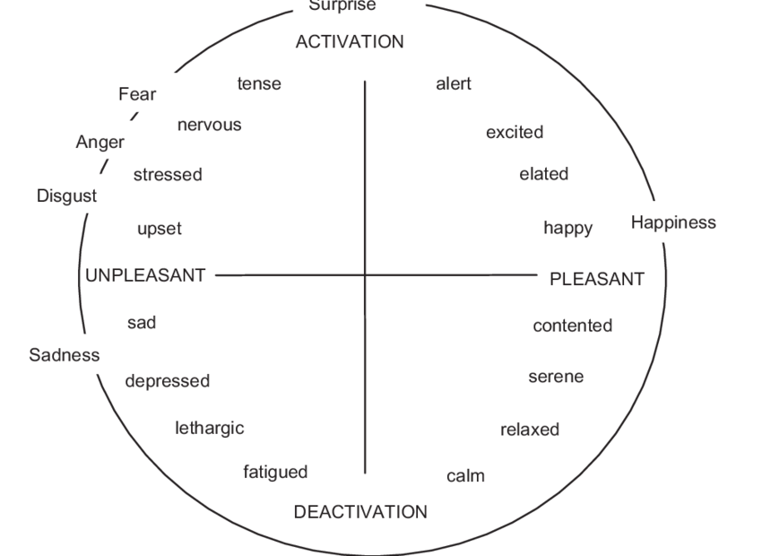

# Assignment - Procedural Icon

You are to create a procedual icon that can represent emotions within the circumplex model as defined by [Russell and Barrett (1999)](https://www.researchgate.net/publication/12946116_Core_affect_prototypical_emotional_episodes_and_other_things_called_emotion_Dissecting_the_elephant). The model is very useful for browsing interfaces dealing with emotional content, like music.

### Requirements
- Implement two inspector sliders:
	- Valence (or hedonic tone) for the horizontal axis.
	- Activation for the vertical axis.
- When you pull the valence slider to the left, the icon should look unpleasent.
- When you pull the valence slider to the right, the icon should look pleasent.
- When you pull the activation slider to the left, the icon should look more deactive.
- When you pull the activation slider to the right, the icon should look more active.

### Delivery 
- Make a screen recording demonstrating your program.
- Post it on Slack in the #assignments channel.

### Get started
- Create a new folder in the root of your project and name it "Assignments". Create a folder inside it and name it "Procedural Icon".
- Copy, modify and extend the code from the GL Shapes examples to get going.