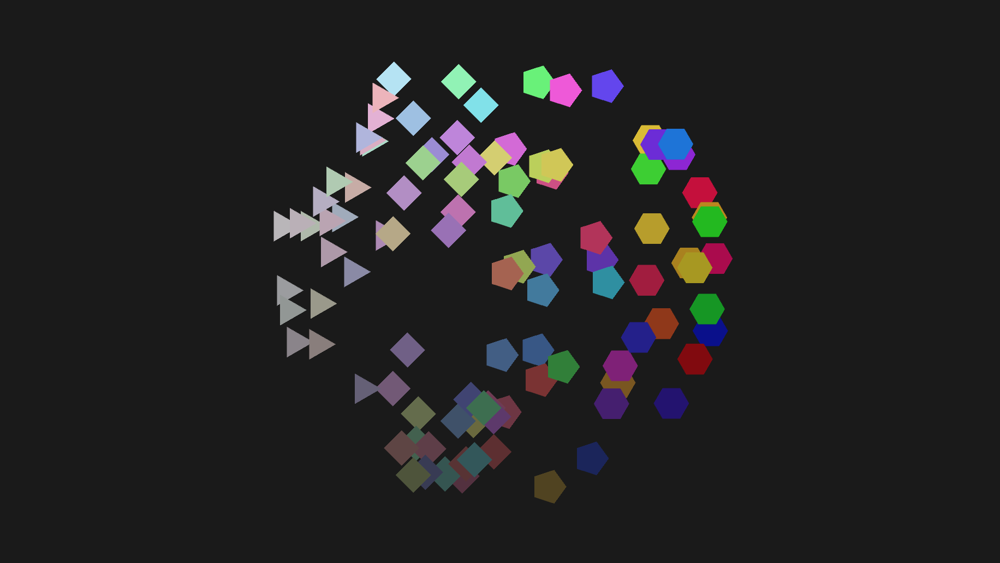

# Assignment - Meshing

Rewrite your Procedural Icon code to render many icons at once in a single mesh. Layout the icons accoring to their input values on the horizontal and vertical axis.

### Guidelines
- Create a new folder in Assignments folder and name it "Meshing". Create a new script and copy code as needed from the Procedural Icon example.

### Delivery
- Take a screenshot and post it on Slack in the homework channel.