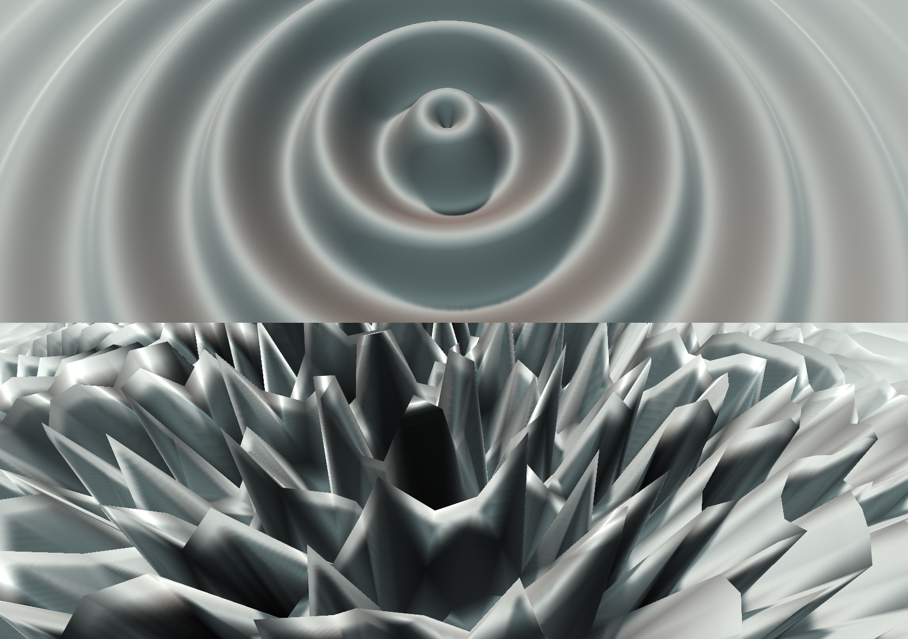

# Assignment - Procedural Object

You are to create a procedural object with settings that control its form.

### Guidelines
- Create a new folder in your Assignments folder and name it Procedural Object.
- Come up with an idea for a simple object. A few examples:
	- Disc?
	- Cone?
	- Pyramid?
	- Cyllinder?
	- Spiral?
	- Sphere?
	- Wave ripples?
- Draw on paper how you would construct it from points and triangles.
- Write a script that builds the mesh adding inspector settings (at least two) like dimensions, resolution and perhaps various forms of deformation.
- The object can be generated once in the Awake method, or in real-time in the Update method.

### Delivery
- Take series of screenshots (at least two), assemble them in one image, and post it on Slack in the #assignment channel.
