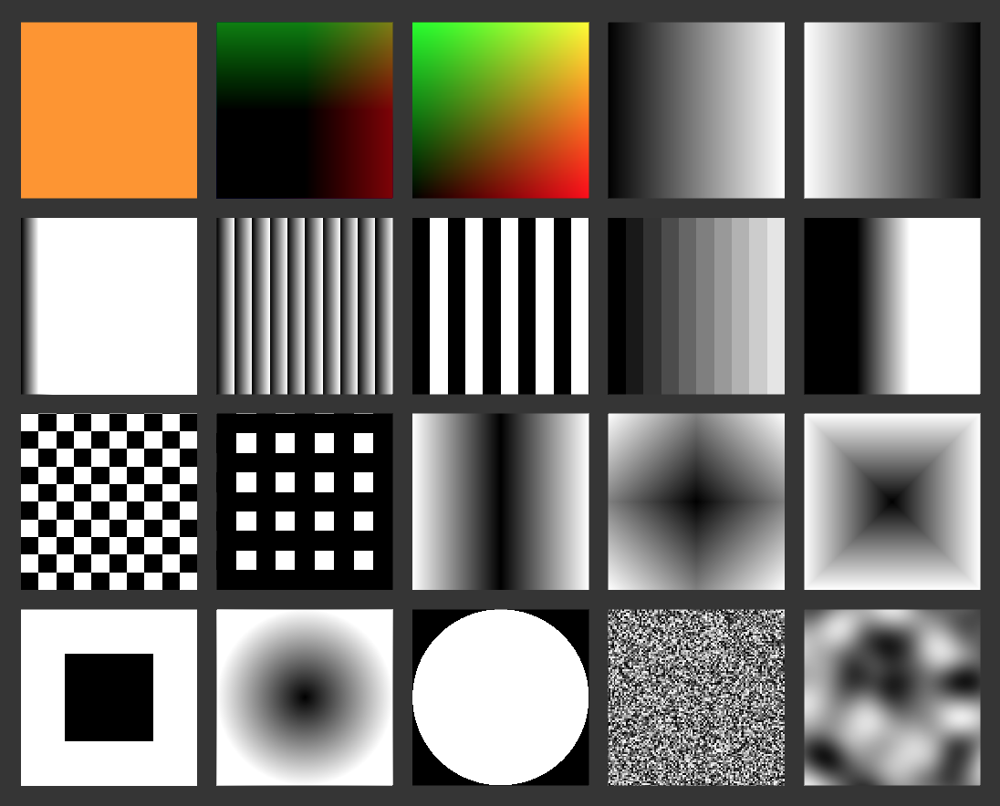

# Assignment - Shader Pattern

You are to create a shader that can produce an interesting pattern that is controllable by properties (shader constants).

### Guidelines
- Create a new folder in your Assignments folder and name it Shader Pattern.
- Copy one of the examples we have made and try to combine different patters. For example:
	- Try multiplying, adding or subtracting two patterns.
	- Try using sin and cosine.
	- Try looking for inspiration on [ShaderToy](https://www.shadertoy.com/).

### Delivery
- Take series of screenshots (at least two), assemble them in one image, and post it on Slack in the #assignment channel.