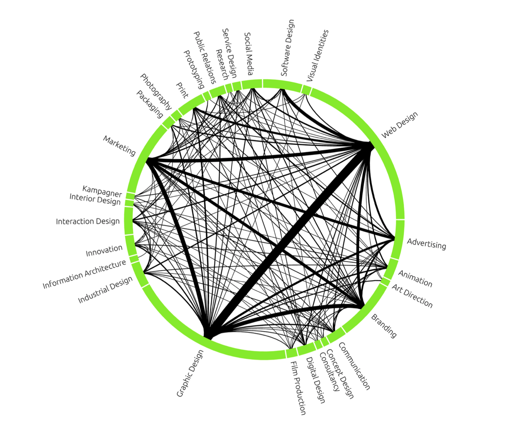
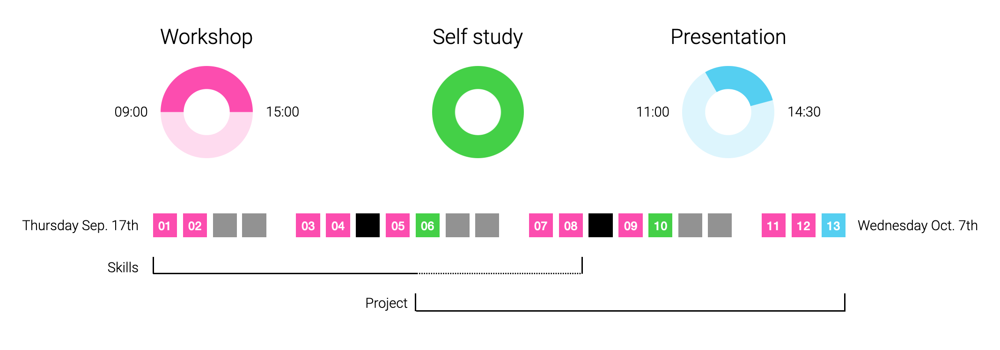

# Data Visualisation Workshop

Taught by [Carl Emil Carlsen](http://cec.dk) at the [The Royal Danish Academy of Fine Arts](https://kadk.dk/en/programme/visuelt-design) (KADK), Visual Design department. Thanks to [Annelie Berner](http://www.annelieberner.com) for sharing inspiration for the workshop.

*September 17th – October 7th, 2020.*  
*10 in-class days, 2 self-study days and 1 presentation day.*

**The content of this repo will be updated throughout the workshop.**

## Introdution

"I see" is a synonym for "I understand". Why is that?

Thanks to the evolution of our visual perception, visualisation is a powerful tool for expanding our mental ability to comprehend patterns. It is one of the "things that make us smart", as [Don Norman](https://www.amazon.com/dp/B00QFJHP94/ref=cm_sw_em_r_mt_dp_L8bmFbKVQ9SEM ) would put it.

Our reality, as well as our interactions in it, are increasingly sensed, sampled, and stored by machines. As the data grows big, so does the opportunity for visualising it, revealing patterns previously invisible to us.

Designing data visualisations has become an important skill set, not only for designers but also for scientists, journalists, business analysts, and other professions that deal with high complexity. The craft integrates topics from graphic design, computer science, human-computer interaction (HCI), statistics, and mathematics. The relatively high technical bar has historically kept professional designers out of the field, to everyone's regret. The bar was lowered over the past two decades, as a new generation of designers entered the field, riding on a wave of more accessible programming tools – notably [Processing](https://processing.org/) and recently more specialized frameworks like [d3.js](https://d3js.org).

By now, numerous relevant tools are available, each having their own advantages and limitations, and most importantly - their own conceptual view of the world. In this workshop, we will be using [Unity3D](https://unity.com) for data visualisation. Dispite being designed for game production, it is highly extensible and serves well as a generalized tool for interaction designers. As we will experience, even though it lacks specialized tools for data visualisaiton, it has all the building blocks necessary for you to design your own specialized tools. As interaction deisgners, knowing that tools shape our thinking, we must be ready to shape our tools.

## Content

Together, we will take the first stab at data visualisation on a theoretical and practical level, while building up a basic understanding of graphics programming and procedural graphics. The skills we will learn are relevant not only to data visualisation but to interactive graphics in general. Similarly, since the technical concepts we will learn are largely dictated by the graphics hardware APIs of today, the knowledge applies not only to Unity but to any realtime graphics environment.

The workshop is divided into two parts. First, we will acquire the skills needed for designing and developing data visualisation projects. Each day will include a mix of lectures and experiments (live coding and micro-assignments). In the second part, each student will conceptualize and realize a small data visualisation project. Finally, the students will present their work and discuss their findings.

#### Topics

* Data visualisation
* Information design theory
* Object-oriented programming in C#
* Working with data
	* Collecting, parsing and filtering data (mainly CSV)
* Graphics programming
	* Graphics in Unity
	* Practical math: vectors, quaternions, and matrices.
	* Immediate and retained mode drawing.
	* Shader programming (ShaderLab, HLSL)
	* GPU Compute (depending on class level)
* Procedural graphics.
	* Basic geometry, layout, and triangulation techniques.
	* Selforganisation (force-directed graphs)

#### Expecations
* Attendance is mandatory. Please inform me via email if you are going to miss a class. Each day builds upon the previous one. Miss a day and catch up hard.
* The skills plan will shift slightly to accommodate the learning pace of the students (do not expect all topics mentioned to be covered).
* This class is participatory. You are expected to participate in discussions and give feedback to other students both in class and participate in their projects.
* The teacher leaves 15:00, but count in at least one hour for daily homework.

#### Hints
* It takes years to get familiar with code so expect to hit your head against your computer for many hours. Anyone with will and persistence can become experts.
* When the teacher is busy, ask your fellow students. Explaining your problem may reveal the solution.

#### Additional tools
Apart from Unity, we will be using the following tools.

* Github + Github Desktop
* Slack
* Google docs, sheets and drive.

#### Readings

I have put together a obligatory curriculum of 100 pages (required by KADK) [here](Readings.pdf) and added aditional readings for the highly motivated.

#### References
All references are collected [here](References.md).

## Skills day plan

Each day will start with a summary and review of homework from the previous day. Then cycles of lectures and practical experiments including live coding and micro assignments. Then a homework assignment for the next day.

### Day 01 (Thursday Sep 17th)
* [Agenda](D01_sep_17/Readme.md).

### Day 02 (Friday Sep 18th)
* [Agenda](D02_sep_18/Readme.md).

### Day 03 (Monday Sep 21st)
* [*Agenda*](D03_sep_21/Readme.md).

### Day 04 (Tuesday Sep 22nd)
* [*Agenda*](D04_sep_22/Readme.md).

### Day 05 (Thursday Sep 24th)
* [*Agenda*](D05_sep_24/Readme.md).

### Day 06 (Friday Sept 25th)
* Independent home work.

## Project day plan
During the project days, students work on individual projects in a shared space. Each day will include a small lecture on a topic relevant to the projects. More advanced graphics topics will be introduced as needed.

### Day 07 (Monday Sep 28th)
* [*Agenda* (to be uploaded)](D07_sep_28/Readme.md).

### Day 08 (Tuesday Sep 29th)
* [*Agenda* (to be uploaded)](D08_sep_29/Readme.md).

### Day 09 (Thursday Oct 1st)
* [*Agenda* (to be uploaded)](D09_oct_01/Readme.md).

### Day 10 (Friday Oct 2nd)
* Independent project work.

### Day 11 (Monday Oct 5th)
* Deadline: minimal viable product.
* In-class project development work.

### Day 12 (Tuesday Oct 6th)
* In-class project development work.

### Day 13 (Wednesday Oct 7th)
* *Note: special time for this day 11:00-14:30.*
* Project presentations.
* Workshop evaluation.